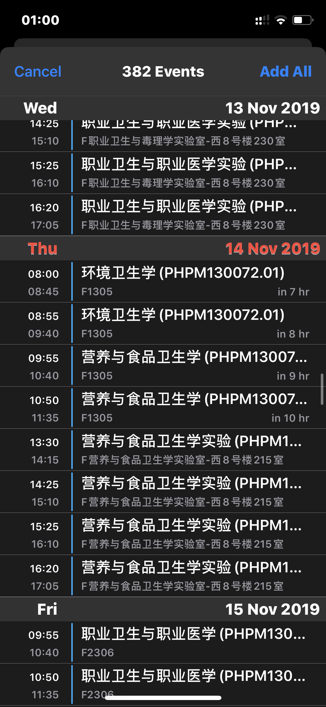
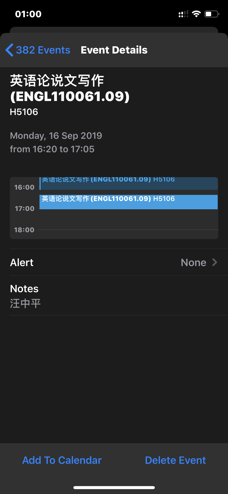

# FDU Timetable

Timetable exporter for FDU. Hope you enjoy this.

自动登录教务系统读取课表，导出为`.ics`文件

Automatically login to jwfw.fdu.edu.cn, export as `.ics` file.

# Setup
- Download this repo, 
- add your username and password to the buttom of `fetchdata.py`, 
- then run`python3 fetchdata.py`

**Note:** 

- It's not recommanded to `airdrop` the produced `ics` file to your phone.As the result, these events will be automatically loaded to your calendar, which I'm sure you will not like it. What's more, you can't add tag to these events either.

- The best way to add these events is to send to your email inbox,
  open it on your phone. Recommend to use the ios default mail app.

- 尽量以邮件的方式发送生成的`fdu_timetable.ics`至你的邮箱，iOS使用系统默认邮箱打开

# Overview
## Login
教务系统登录：`fdulogin.py`

## Table Retrieve
Implemented in: `fetchdata.py`

## Convert to .ics file
Implemented in: `fileman.py`

# License
See `LICENSE` for more information.

# Acknowledgments
[FDU_COURSETABLE](https://github.com/syz913/FDU_COURSETABLE)

Miss. Florence
